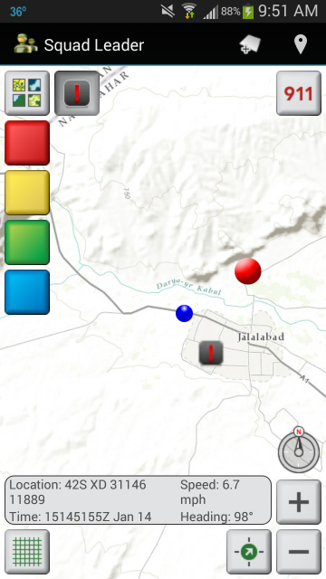

military-apps-library-java
==========================

A common, SDK-agnostic Java library for building military-oriented geospatial apps, especially for ArcGIS for the Military.

## Sections

* [Features](#features)
* [Requirements](#requirements)
* [Instructions](#instructions)
* [Resources](#resources)
* [Issues](#issues)
* [Contributing](#contributing)
* [Licensing](#licensing)

## Features

- Use MapController to access basic map-related functionality. Your implementation will fill in the details based on the SDK you're using.
- Read a map configuration XML file and return a MapConfig object for the layers in the map configuration.
- Read an ArcGIS Server REST service endpoint and return a list of LayerInfo objects for the layers in the service.
- Interface with the device's location provider, and/or run a location simulator.
- Send and receive Geomessages over UDP, including spot reports, position reports, and chem lights. Note that your firewall must allow the Java Runtime Environment (JRE) to operate on the UDP port that you use for messaging, or the message sending and receiving will not happen (see the section on unit tests below).

To see this library in use, visit the [squad-leader-android repository](https://github.com/Esri/squad-leader-android).

## Requirements

* Build Requirements
    * Java compiler
        * Java SE Development Kit (JDK) 8 or higher
        * Android Development Kit, if including this library in an Android library or application
* Optional
    * Apache Ant - only needed if building and running the provided automated unit tests with ant
        * Note: Java 8 requires Ant 1.9+, so you must use Ant 1.9 or higher when building for Java SE.

## Instructions

### Usage

You can reference this library's source code and .jar files in the lib directory in your project. If your project uses GitHub, you could create a submodule in your project that references this repository, though that is not required. If you prefer to work with binaries rather than source, you can build this library as a .jar; just remember to include the .jar files in this library's lib directory too.

### Unit tests

The library comes with a number of unit tests for quality assurance. It is advisable to run the unit tests before committing changes to your fork and/or submitting a pull request. Some of the tests perform UDP networking for messaging (see the section on example capabilities above). If you are running a local firewall on your machine, such as Windows Firewall, you may receive warnings or dialogs asking whether to allow java.exe to use network resources. If you do not unblock Java when these dialogs are presented, some of the tests will likely fail.

## Resources

* Learn more about Esri's [ArcGIS for the Military solution](http://solutions.arcgis.com/military/).
* [squad-leader-android repository](https://github.com/Esri/squad-leader-android)

## Issues

Find a bug or want to request a new feature?  Please let us know by submitting an issue.

## Contributing

Esri welcomes contributions from anyone and everyone. Please see our [guidelines for contributing](https://github.com/esri/contributing).

## Licensing

Copyright 2013-2014 Esri

Licensed under the Apache License, Version 2.0 (the "License"); you may not use this file except in compliance with the License. You may obtain a copy of the License at

   http://www.apache.org/licenses/LICENSE-2.0

Unless required by applicable law or agreed to in writing, software distributed under the License is distributed on an "AS IS" BASIS, WITHOUT WARRANTIES OR CONDITIONS OF ANY KIND, either express or implied. See the License for the specific language governing permissions and limitations under the License.

A copy of the license is available in the repository's [license.txt](license.txt) file.

Portions of this code use third-party libraries:
- Use of the JSON Java library available at http://www.json.org/java/index.html is governed by the JSON License.
- Use of the JUnit library available at https://github.com/junit-team/junit is governed by the [Eclipse Public License](https://github.com/junit-team/junit/blob/master/LICENSE.txt).

